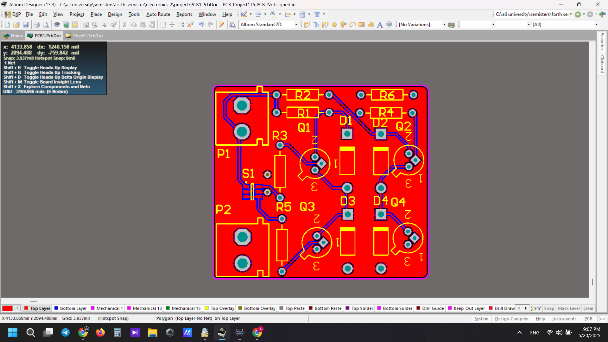
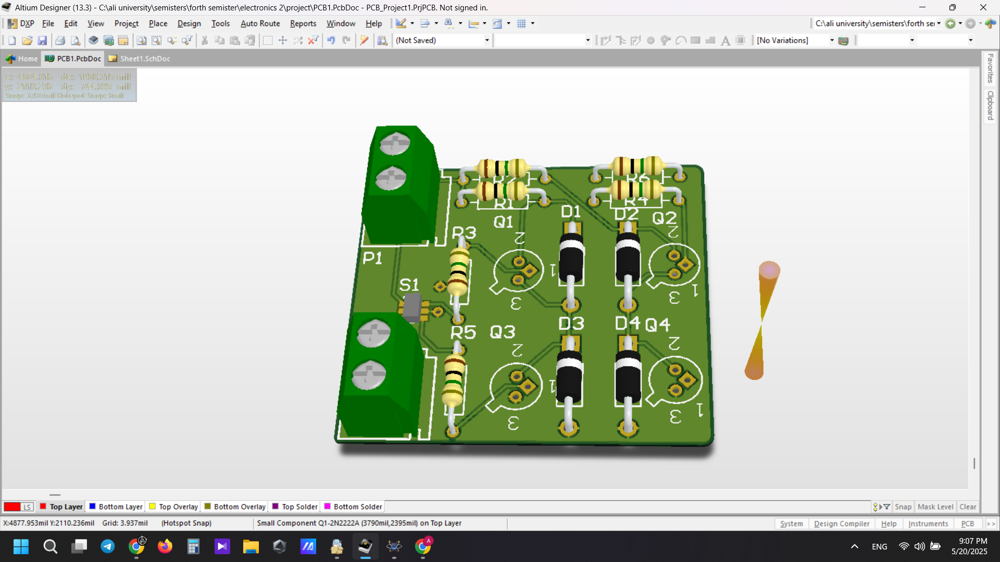

# BJT H-Bridge Motor Driver

A discrete-component H-bridge motor driver designed as a university electronics project.

The project includes **schematic design, PCB layout, 3D PCB visualization, fabrication, and hardware assembly**. The circuit was developed using **Altium Designer** and implemented using discrete BJTs, diodes, resistors, terminal blocks, and a control switch.

## Project Highlights

- Discrete BJT H-bridge topology
- Forward/reverse motor drive capability
- Schematic design in Altium Designer
- Custom PCB layout
- 3D PCB visualization
- Physical PCB fabrication
- Component assembly and hardware implementation
- Source design files included

## Circuit Design

The H-bridge uses four discrete transistors arranged in a bridge configuration.

Four diodes are used for protection against inductive voltage transients generated by the motor, while resistors provide the required transistor biasing and control paths.

The output terminals are intended for connection to the load, while the remaining terminal provides the circuit power connection.

## Main Components

- 4 × BJT transistors
- 4 × protection diodes
- 6 × resistors
- DPDT / control switch
- 2-pin terminal blocks
- Custom PCB

## Schematic


The original Altium schematic source file is available in the `altium` directory.

## PCB Layout

The PCB was designed and routed in Altium Designer.



## 3D PCB Visualization

A 3D visualization was used to inspect component placement and board geometry before fabrication.



## Hardware Implementation

The PCB was fabricated and the components were physically assembled.


## Altium Source Files

The repository includes the original project files:

- `Sheet1.SchDoc` — schematic source
- `PCB1.PcbDoc` — PCB layout
- `PCB_Project1.PrjPCB` — Altium project
- `PCB_Project1.PrjPCBStructure` — project structure

These files are available in the [`altium`](altium/) directory.

## Project Structure

```text
BJT-H-Bridge-Motor-Driver/
│
├── README.md
│
├── altium/
│   ├── Sheet1.SchDoc
│   ├── PCB1.PcbDoc
│   ├── PCB_Project1.PrjPCB
│   └── PCB_Project1.PrjPCBStructure
│
└── images/
    ├── schematic.png
    ├── pcb-layout.png
    ├── pcb-3d-view.png
    └── assembled-pcb.jpg
