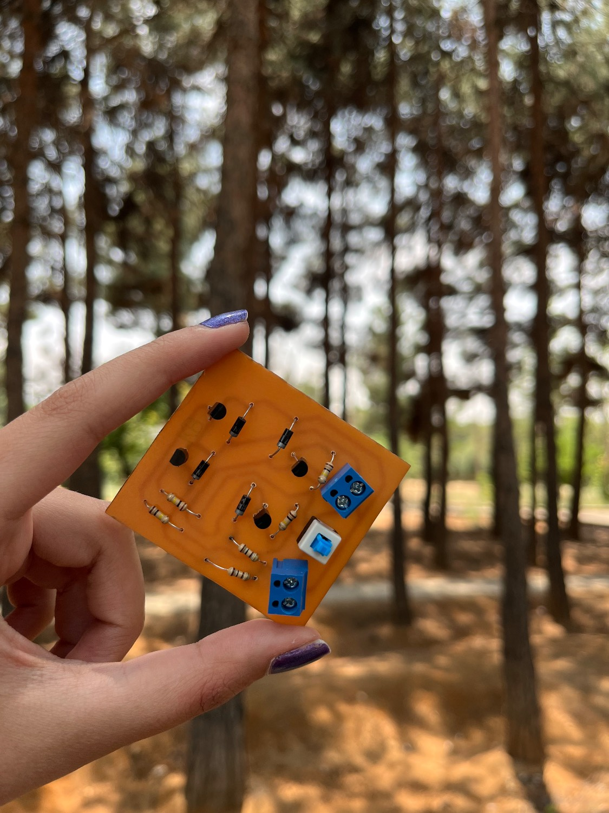
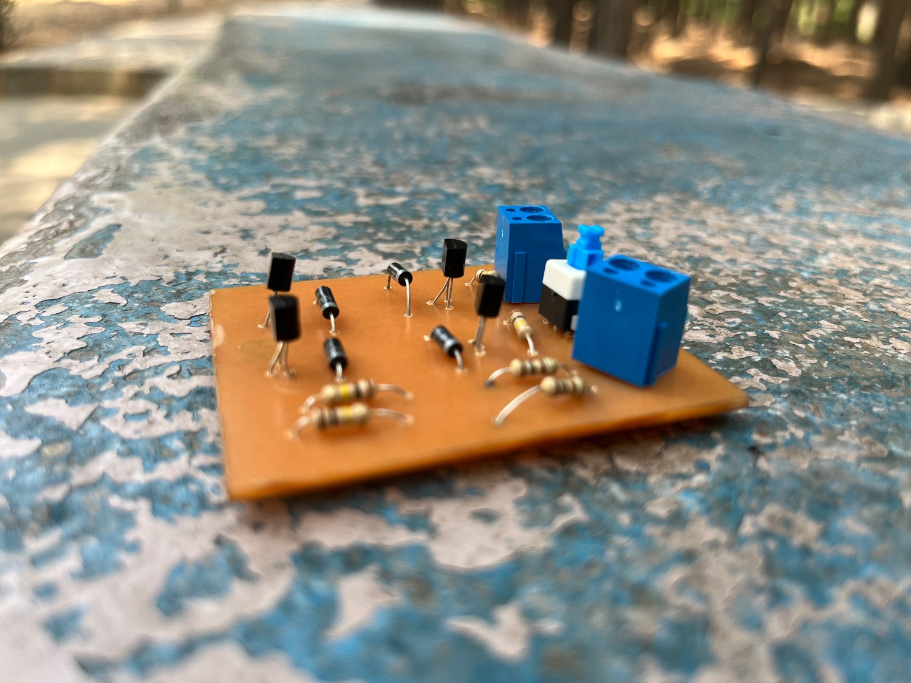

# BJT H-Bridge Motor Driver

## Digital Electronics Project

A discrete-component **BJT H-Bridge Motor Driver** designed and implemented as a university electronics project.

The project covers the complete hardware development process, including:

- Circuit design
- Altium Designer schematic capture
- PCB layout design
- PCB fabrication
- Hardware assembly
- Functional testing

The motor driver is based on a transistor H-bridge topology that enables bidirectional DC motor control.

---

# Project Overview

An H-Bridge circuit is a widely used motor control topology that allows a DC motor to rotate in both directions by changing the polarity of the voltage applied to the motor terminals.

This project implements an H-Bridge using discrete bipolar junction transistors (BJTs), protection diodes, biasing resistors, and a manual control switch.

The designed board provides:

- Forward motor rotation
- Reverse motor rotation
- Protection against inductive voltage spikes
- Compact custom PCB implementation

---

# System Features

- Discrete BJT H-Bridge configuration
- Bidirectional DC motor control
- Flyback protection diodes
- Custom PCB design
- Altium Designer source files included
- Fabricated PCB prototype
- Hardware assembly and testing

---

# Circuit Description

The circuit consists of four BJTs arranged in an H-bridge structure.

By controlling the switching states of the transistors, the polarity across the motor terminals can be reversed.

## Operating Modes

| Control State | Motor Operation |
|---|---|
| Forward Switching | Clockwise rotation |
| Reverse Switching | Counter-clockwise rotation |
| OFF State | Motor stopped |

---

# Main Components

| Component | Quantity | Function |
|---|---:|---|
| BJT Transistors | 4 | H-bridge switching elements |
| Diodes | 4 | Flyback voltage protection |
| Resistors | 6 | Biasing and current limiting |
| Control Switch | 1 | Direction control |
| Terminal Blocks | 2 | Power and motor connection |
| Custom PCB | 1 | Hardware implementation |

---

# PCB Design

The PCB was designed using **Altium Designer**.

The design includes:

- Component placement
- PCB routing
- Power traces
- Through-hole component footprints
- Manufacturing-ready layout

## PCB Layout


---

# 3D PCB Visualization

A 3D PCB model was generated in Altium Designer to verify:

- Component placement
- Board dimensions
- Mechanical arrangement


---

# Hardware Implementation

After PCB fabrication, all components were assembled manually and tested.

The final prototype includes:

- Mounted BJTs
- Protection diodes
- Bias resistors
- Screw terminals
- Control switch



Additional hardware view:



---

# Altium Designer Files

The original design files are included in the `altium` directory.

Files:

```
altium/

├── Sheet1.SchDoc
├── PCB1.PcbDoc
├── PCB_Project1.PrjPCB
└── PCB_Project1.PrjPCBStructure
```

Description:

- `Sheet1.SchDoc`  
  → Complete circuit schematic

- `PCB1.PcbDoc`  
  → PCB layout design

- `PCB_Project1.PrjPCB`  
  → Main Altium project file

- `PCB_Project1.PrjPCBStructure`  
  → Project structure file

---

# Repository Structure

```
BJT-H-Bridge-Motor-Driver/

│
├── README.md
│
├── altium/
│   ├── Sheet1.SchDoc
│   ├── PCB1.PcbDoc
│   ├── PCB_Project1.PrjPCB
│   └── PCB_Project1.PrjPCBStructure
│
└── images/
    ├── pcb-layout.png
    ├── pcb-3d-view.png
    ├── assembled-pcb.jpeg
    └── assembled-pcb-angle.jpeg
```

---

# Design Tools

## Software

- Altium Designer

## Hardware

- Discrete BJTs
- Diodes
- Resistors
- PCB board
- DC motor

---

# Results

The fabricated PCB successfully demonstrates the operation of a discrete BJT H-Bridge motor driver.

The project verified:

✔ PCB design workflow  
✔ Hardware fabrication  
✔ Component assembly  
✔ Bidirectional motor control concept  

---

# Conclusion

This project demonstrates the complete design cycle of a practical motor driver circuit, from schematic design to PCB fabrication and hardware implementation.

The use of discrete components provides a clear understanding of transistor switching behavior and H-Bridge motor control principles.

---

# Author

- Arghavan Memari
- Erfan Feghhi
- Alireza Montajab

Digital Electronics Course Project
